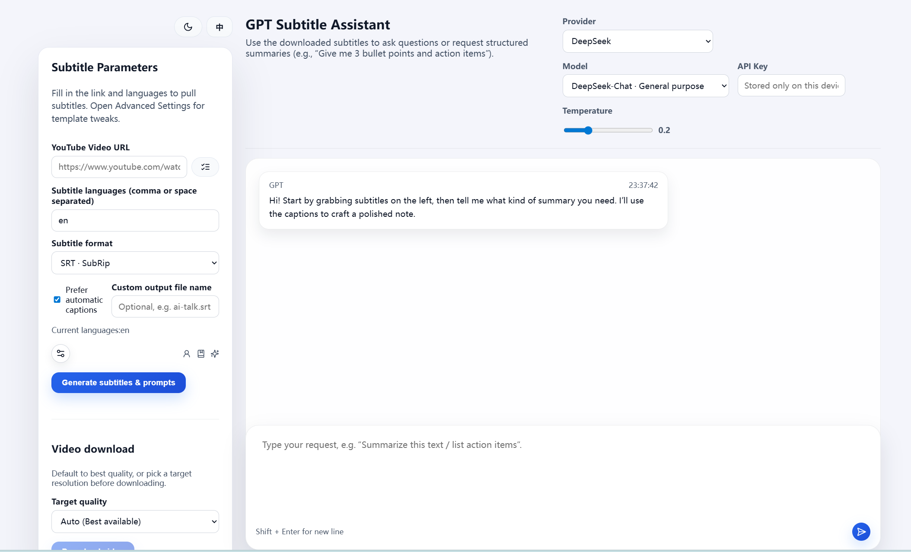

# YouTube Video Reading Assistant

English | [中文](README.md)

Quickly convert YouTube video content into reusable structured notes: one-click subtitle extraction, prompt generation, LLM-powered summarization, and generate structured notes.



## Key Features

- Multi-format and multi-language subtitle extraction (SRT/VTT/ASS/JSON3/TTML, switch freely between auto-generated and manual subtitles)
- Templated prompts and GPT chat interface, supporting OpenAI / DeepSeek / Doubao / GLM / Spark / Grok / Gemini and other compatible APIs
- Persistent download history in `backend/storage/**`, providing unified management for subtitles, prompts, and video files
- Frontend: React + Vite + TypeScript, with dark mode, floating input area, Markdown/LaTeX rendering
- Backend: FastAPI + yt-dlp, clean API design, easy to extend, can be started with `start-dev.*` scripts

## Tech Stack

- **Frontend**: React 18 · TypeScript · Vite · React Markdown · KaTeX
- **Backend**: FastAPI · Pydantic · yt-dlp · OpenAI-compatible clients
- **Storage**: Local `backend/storage` (subtitles/prompts/videos exposed via `/storage/**`)

## Quick Start

```bash
# Backend
cd backend
python -m venv .venv && .venv/Scripts/activate
pip install -r requirements.txt
copy env.example .env
uvicorn app.main:app --reload --port 8866

# Frontend
cd frontend
npm install
copy env.example .env
npm run dev
```

During development, Vite proxies `/api` and `/storage` to the backend (`http://localhost:8866`), so you can directly access `http://localhost:5173`.

**Port Configuration**:
- Backend default port: `8866`
- Frontend dev server port: `5173`
- In development mode, the frontend accesses the backend through Vite proxy, no need to configure `VITE_API_BASE_URL`
- In production mode, you need to configure `VITE_API_BASE_URL` to point to the actual backend address

## Environment Configuration

| Variable | Description |
| --- | --- |
| `YT_DLP_BINARY` | Custom yt-dlp path (optional) |
| `OPENAI_*`, `DEEPSEEK_API_KEY`, `DOUBAO_API_KEY`, `ZHIPU_API_KEY`, `SPARK_API_KEY`, `GROK_API_KEY`, `GEMINI_API_KEY` | LLM Provider authentication |
| `VITE_API_BASE_URL` | Backend URL for frontend calls in production mode (not needed in development mode, uses Vite proxy) |
| `VITE_*_API_KEY` | Frontend keys for auto-filling during development only (optional) |

More providers can be extended in `backend/providers.yaml` and `frontend/src/data/providers.ts`.

## Core API Endpoints

- `POST /api/subtitles/download`: Extract + convert subtitles, and generate downloadable files/prompts
- `POST /api/subtitles/list`: List available subtitle tracks
- `POST /api/subtitles/analyze`: Call specified LLM with subtitles + instructions, supports streaming responses
- `POST /api/videos/download` & `GET /api/videos/status/{id}` / `fetch/{id}`: Asynchronous video download and retrieval

## Production Recommendations

- Use `.env` to manage keys, and install a stable version of `yt-dlp` on the server
- Configure persistent storage for `backend/storage` (this repository ignores large files by default, keeping only `.gitkeep`)
- Run `npm run build` and `pytest`/`mypy` (if available) before deployment to ensure code quality

Feel free to share ideas or improvements via Issues / PRs. Enjoy! 🎬

