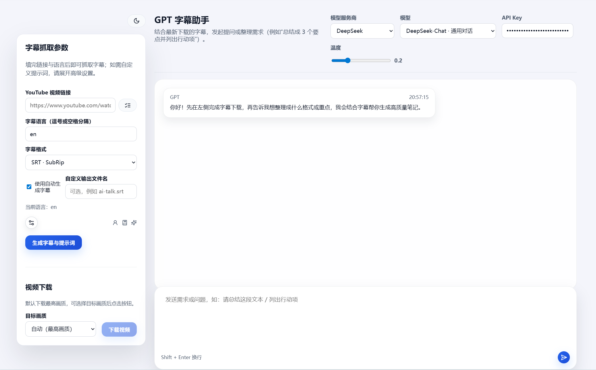

# YouTube 视频阅读助手

[English](README.en.md) | 中文

快速把 YouTube 视频内容转换成可复用的结构化笔记：一键抓字幕、生成提示词、调用 LLM 总结，生成结构化笔记。



## 主要特性

- 多字幕格式与多语言抓取（SRT/VTT/ASS/JSON3/TTML，自动字幕或人工字幕自由切换）
- 模板化提示词与 GPT 对话区，支持 OpenAI / DeepSeek / Doubao / GLM / Spark / Grok / Gemini 等兼容 API
- 下载历史持久化在 `backend/storage/**`，提供字幕、提示词、视频三类文件的统一管理
- 前端 React + Vite + TypeScript，支持夜间模式、悬浮输入区、Markdown/LaTeX 渲染
- 后端 FastAPI + yt-dlp，接口清晰、易扩展，可自带脚本 `start-dev.*` 一键启动

## 技术栈

- **Frontend**: React 18 · TypeScript · Vite · React Markdown · KaTeX
- **Backend**: FastAPI · Pydantic · yt-dlp · OpenAI-compatible clients
- **Storage**: 本地 `backend/storage`（字幕/提示词/视频均通过 `/storage/**` 暴露）

## 快速开始

```bash
# Backend
cd backend
python -m venv .venv && .venv/Scripts/activate
pip install -r requirements.txt
copy env.example .env
uvicorn app.main:app --reload --port 8866

# Frontend
cd frontend
npm install
copy env.example .env
npm run dev
```

开发阶段 Vite 已代理 `/api` 与 `/storage` 到后端（`http://localhost:8866`），直接访问 `http://localhost:5173` 即可。

**端口说明**：
- 后端默认端口：`8866`
- 前端开发服务器端口：`5173`
- 开发模式下，前端通过 Vite 代理访问后端，无需配置 `VITE_API_BASE_URL`
- 生产模式下，需要配置 `VITE_API_BASE_URL` 指向实际的后端地址

## 环境配置

| 变量 | 说明 |
| --- | --- |
| `YT_DLP_BINARY` | 自定义 yt-dlp 路径（可选） |
| `OPENAI_*`, `DEEPSEEK_API_KEY`, `DOUBAO_API_KEY`, `ZHIPU_API_KEY`, `SPARK_API_KEY`, `GROK_API_KEY`, `GEMINI_API_KEY` | LLM Provider 认证信息 |
| `VITE_API_BASE_URL` | 生产模式下前端调用的后端地址（开发模式无需配置，使用 Vite 代理） |
| `VITE_*_API_KEY` | 仅用于开发阶段自动填充的前端 Key（可选） |

更多 Provider 可在 `backend/providers.yaml` 与 `frontend/src/data/providers.ts` 中扩展。

## 核心接口

- `POST /api/subtitles/download`：抓取 + 转换字幕，并生成可下载文件/提示词
- `POST /api/subtitles/list`：列出可用字幕轨道
- `POST /api/subtitles/analyze`：结合字幕 + 指令调用指定 LLM，可流式返回
- `POST /api/videos/download` & `GET /api/videos/status/{id}` / `fetch/{id}`：视频异步下载与拉取

## 生产建议

- 使用 `.env` 管理 Key，并在服务器安装稳定版本的 `yt-dlp`
- 为 `backend/storage` 配置持久化存储（本仓库已默认忽略大文件，仅保留 `.gitkeep`）
- 部署前运行 `npm run build` 与 `pytest`/`mypy`（如有）保证代码质量

欢迎通过 Issue / PR 分享想法或改进。祝使用愉快！ 🎬

